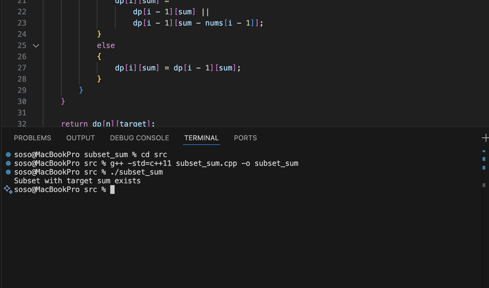

# Subset Sum Problem 

## Overview

In this project I implemented the Subset Sum problem.

The goal of the subset sum problem is to determine whether a subset of numbers from a given set adds up to a specific target value.

This problem is well known in computer science and is classified as NP-complete, which means it becomes very difficult to solve efficiently for large inputs.

## How the Algorithm Works

The algorithm checks whether a subset of the numbers can produce the target sum.

Dynamic programming is used to build a table that stores whether a particular sum can be formed using a certain number of elements.

The basic idea is:

1. Create a table where rows represent elements in the set.
2. Columns represent possible sums from 0 to the target value.
3. For each number, decide whether including it helps create the target sum.
4. Fill the table based on previously computed results.

If the final table entry is true, then a subset exists that produces the target sum.

## Time Complexity

The time complexity of this dynamic programming solution is O(n × target).

Where

- n is the number of elements in the set
- target is the target sum we want to reach

## Implementation

The algorithm is implemented in C++.

Source file:

src/subset_sum.cpp

The program checks whether a subset of numbers can produce the given target value.

## What I Learned

While working on this problem I learned more about:

- how subset selection problems work
- how dynamic programming can solve NP-related problems more efficiently
- how table-based approaches store intermediate results

# Program Output

Below is a screenshot of the program running in VS Code.

